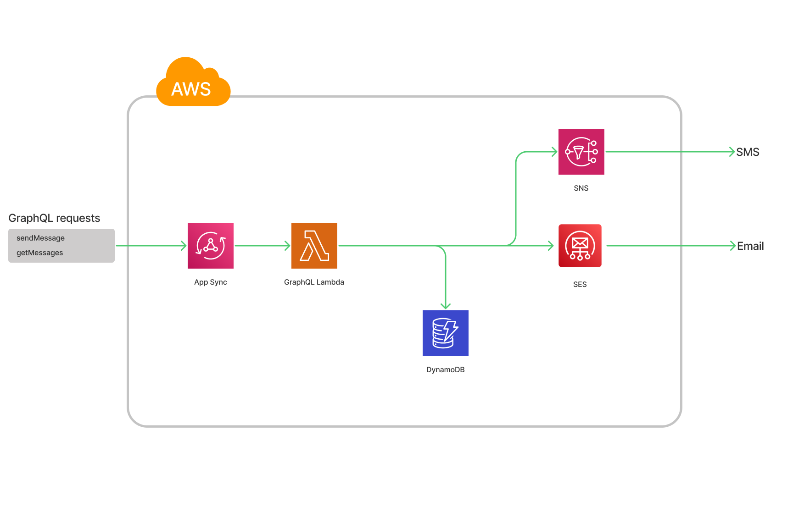

# Serverless Messenger (TM-Pro dev assignment)

## Service Requirements:

Build a message delivery feature in AWS that can send messages to users and also keep track of what has been sent.

-   Create an API to post a message which can be delivered to a recipient via SMS/email and keep a record of it
-   Create an API to retrieve the messages sent to a particular recipient

## Prerequisites

-   Sending SMS messages with SNS have some [limitations](https://docs.aws.amazon.com/sns/latest/dg/sns-sms-sandbox-moving-to-production.html)

-   Sending Email messages with SES also have some [limitations](https://docs.aws.amazon.com/ses/latest/dg/request-production-access.html)

## Architecture diagram:



## DynamoDB table design

Access patterns

| Access pattern | Target     | Parameters | Notes                                                |
| -------------- | ---------- | ---------- | ---------------------------------------------------- |
| Get messages   | Main table | - to       | Retrieve the messages sent to a particular recipient |

Table design

| Entity  | PK             | SK                    |
| ------- | -------------- | --------------------- |
| Message | MESSAGE#\<to\> | MESSAGE#\<messageId\> |

## Security:

-   DynamoDB encryption at rest enabled: Server-side KMS encryption with a master key managed by AWS
-   SNS encryption of data in transit: `"aws:SecureTransport": "true"` policy condition
-   SES encryption of data in transit: `"aws:SecureTransport": "true"` policy condition
-   AppSync GraphQL API_KEY Authorization

## Preparations and deployment

-   Setup deployment properties in `serverless-messenger-stack.ts` file;

| Property           | Example values           | Meaning                                            |
| ------------------ | ------------------------ | -------------------------------------------------- |
| STAGE              | 'dev' / 'stage' / 'prod' | Prefix for all created resources                   |
| SNS_REGION         | 'eu-central-1' / etc...  | SNS service region                                 |
| SES_REGION         | 'eu-central-1' / etc...  | SES service region                                 |
| DEFAULT_EMAIL_FROM | 'no-reply@example.com'   | Default `from` address for outgoing email messages |

-   CDK deployment

```bash
# Bootstrap cdk environment
cdk bootstrap --profile <AWS_PROFILE_NAME>

# Deploy stack
cdk deploy --profile <AWS_PROFILE_NAME>
```

-   Get endpoint url and API Key

`cdk deploy` command will provide you GraphQL endpoint URL and API Key value:

```bash
 ✅  ServerlessMessengerStackdev

✨  Deployment time: 100.1s

Outputs:
ServerlessMessengerStackdev.serverlessmessengerapikeyvaluedev = <API_KEY_VALUE>
ServerlessMessengerStackdev.serverlessmessengergraphqlurldev = https://<API_ID>.appsync-api.eu-central-1.amazonaws.com/graphql

✨  Total time: 119.98s
```

## Usage

### Authorization header

Include authorization header into your requests to GraphQL endpoint:

```
"x-api-key": " <API_KEY_VALUE>"
```

### Send Email

Example request:

```graphql
mutation sendMessage($input: MessageInput!) {
    sendMessage(input: $input) {
        to
        from
        body
        deliveryMethod
        deliveryStatus
        recipientId
        senderId
    }
}
```

Variables:

```json
{
    "input": {
        "to": "<TO_EMAIL>",
        "subject": "Message",
        "body": "Hello world",
        "deliveryMethod": "EMAIL"
    }
}
```

Example response:

```json
{
    "data": {
        "sendMessage": {
            "to": "<TO_EMAIL>",
            "from": "<DEFAULT_FROM_EMAIL>",
            "subject": "Message",
            "body": "Hello world",
            "deliveryMethod": "EMAIL",
            "deliveryStatus": "ACCEPTED",
            "recipientId": null,
            "senderId": null
        }
    }
}
```

### Send SMS

Example request:

```graphql
mutation sendMessage($input: MessageInput!) {
    sendMessage(input: $input) {
        to
        body
        deliveryMethod
        deliveryStatus
        recipientId
        senderId
    }
}
```

Variables:

```json
{
    "input": {
        "to": "<TO_PHONE_NUMBER>",
        "body": "Hello world",
        "deliveryMethod": "SMS"
    }
}
```

Example response:

```json
{
    "data": {
        "sendMessage": {
            "to": "<TO_PHONE_NUMBER>",
            "body": "Hello world",
            "deliveryMethod": "SMS",
            "deliveryStatus": "ACCEPTED",
            "recipientId": null,
            "senderId": null
        }
    }
}
```

### Retrieve the messages sent to a particular recipient

Example request:

```graphql
query getMessages($filter: MessageFilter!, $first: Int, $after: String) {
    getMessages(filter: $filter, first: $first, after: $after) {
        data {
            id
            to
            body
            deliveryMethod
            deliveryStatus
            from
            recipientId
            senderId
        }
        pageInfo {
            hasNextPage
            endCursor
        }
    }
}
```

Variables:

```json
{
    "filter": {
        "to": "<TO_EMAIL>"
    },
    "first": 2,
    "after": null
}
```

Example response:

```json
{
    "data": {
        "getMessages": {
            "data": [
                {
                    "id": "MESSAGE#01G8NB4BN5NVP67PFG8TYNDMSW",
                    "to": "<TO_EMAIL>",
                    "from": "<DEFAULT_FROM_EMAIL>",
                    "body": "Hello world 1",
                    "deliveryMethod": "EMAIL",
                    "deliveryStatus": "ACCEPTED",
                    "recipientId": null,
                    "senderId": null
                },
                {
                    "id": "MESSAGE#01G8NBDZ6YMH5SCEQ1BGR3QTWG",
                    "to": "<TO_EMAIL>",
                    "from": "<DEFAULT_FROM_EMAIL>",
                    "body": "Hello world 2",
                    "deliveryMethod": "EMAIL",
                    "deliveryStatus": "ACCEPTED",
                    "recipientId": null,
                    "senderId": null
                }
            ],
            "pageInfo": {
                "hasNextPage": true,
                "endCursor": "MESSAGE#01G8NBDZ6YMH5SCEQ1BGR3QTWG"
            }
        }
    }
}
```

## Limitations and room for improvement

-   Service allows to store `senderId` and `recipientId` attributes of message, but has zero knowledge of `SENDER` entity, and does not allow to retrieve all messages by `senderId` (can be easily added using DynamoDB GSI with PK `MESSAGE#<senderId>`)
-   Service is not checking delivery status of SMS messages, message `ACCEPTED` delivery status means that message is valid and accepted by SNS for delivery; However, the message might not be delivered for other reasons (e.g. sandbox limitations).
